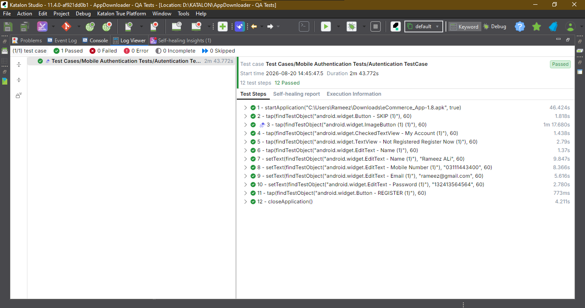
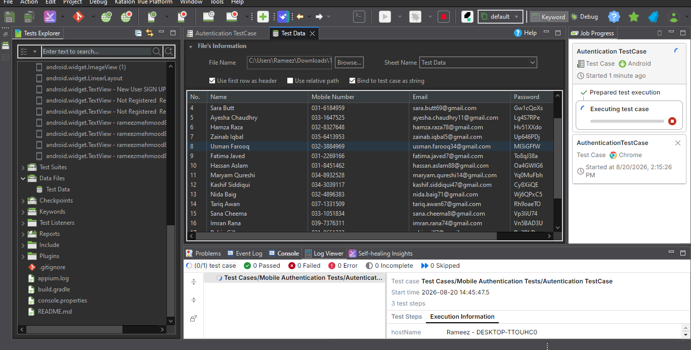

# Login Automation Testing — Data-Driven QA Suite

Automated mobile login testing suite built using **Katalon Studio**, validating the authentication flow of an Android application through **data-driven testing**. This project demonstrates end-to-end mobile QA automation — from test data preparation through variable binding, test execution, and reporting.

## Overview

This suite verifies login functionality by executing the same automated test case against **20 unique sets of test data**, ensuring the authentication flow behaves correctly across a range of realistic user inputs rather than a single hardcoded scenario.

## Approach

- **Test Data Preparation** — created a structured Excel dataset containing 20 records (Name, Mobile Number, Email, Password) to drive the login test case
- **Data-Driven Testing** — configured Katalon to read from the Excel file and bind each row's values to test case variables, executing the login flow once per data set
- **Variable Binding** — learned and applied variable declaration and data binding within test cases to dynamically pass test data instead of hardcoding values
- **Object Repository** — captured and reused UI element locators (email field, password field, login button) via Object Spy
- **Test Suite Execution** — grouped the login test case into a Test Suite to run all 20 data-driven iterations in a single execution, with consolidated pass/fail reporting

## Tools & Technologies

- **Katalon Studio** — test automation IDE
- **Appium (UiAutomator2)** — underlying mobile automation engine
- **Excel (.xlsx)** — external test data source for data-driven testing
- **Android SDK / ADB** — real device communication and debugging
- **Physical Android Device** — all tests executed on a real local device
- **Git** — version control

## Test Case

| ID | Name | Description | Data Source | Priority |
|----|------|--------------|--------------|----------|
| TC_Login_DataDriven_001 | Verify login with multiple user credentials | Executes the login flow using 20 unique data sets (Name, Mobile Number, Email, Password) to validate authentication behavior across varied inputs | Test_Data.xlsx | High |

## Project Structure

```
├── Data Files/           # Excel test data (20 rows: Name, Mobile, Email, Password)
├── Scripts/              # Groovy test scripts
├── Object Repository/    # Captured UI element locators
├── Test Suites/          # Grouped test case collections
├── Reports/              # Execution results (pass/fail, screenshots)
└── screenshots/          # Project documentation screenshots
```

## How to Run

1. Open project in Katalon Studio
2. Connect an Android device via USB with debugging enabled
3. Confirm `Data Files/Test_Data.xlsx` is linked to the login test case
4. Open the Test Suite and click **Run**, selecting the connected device
5. View consolidated results (20 iterations) under `Reports/`

## Test Data

Login test data used for data-driven execution is available here: [Test_Data.xlsx](Test_Data.xlsx)

| Name | Mobile Number | Email | Password |
|------|---------------|-------|----------|
| Ahmed Khan | 031X-XXXXXXX | ahmed.khan1@gmail.com | Xy3kLmA9 |
| Ali Malik | 032X-XXXXXXX | ali.malik2@gmail.com | Qw8pRtB2 |
| ... | ... | ... | *(20 rows total — see full file above)* |

## Screenshots





## Key Learnings

- Designing and preparing structured test data for data-driven testing
- Binding external Excel data to test case variables in Katalon
- Running a single test case across multiple data iterations for broader coverage
- Real-device setup, debugging, and Object Repository management
- Structuring and executing Test Suites with consolidated reporting

## Author

Rameez 
